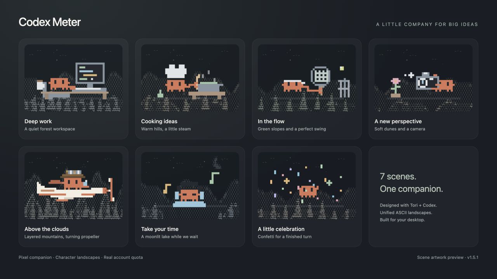
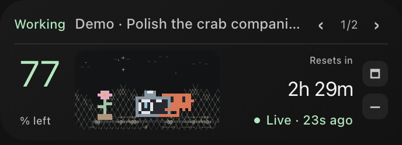
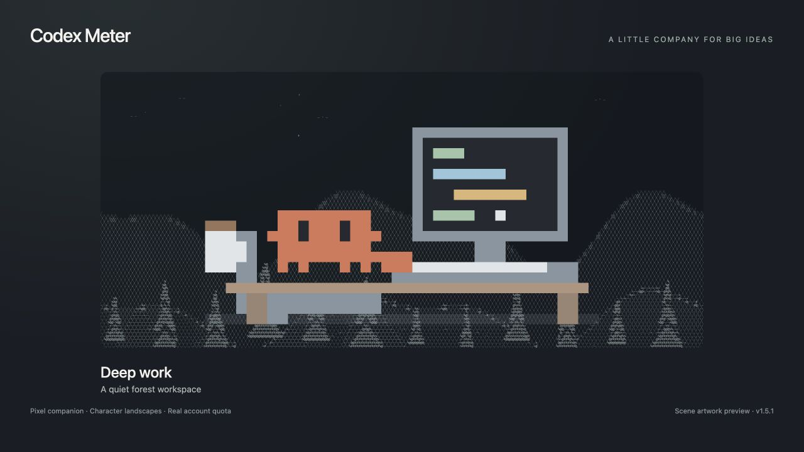
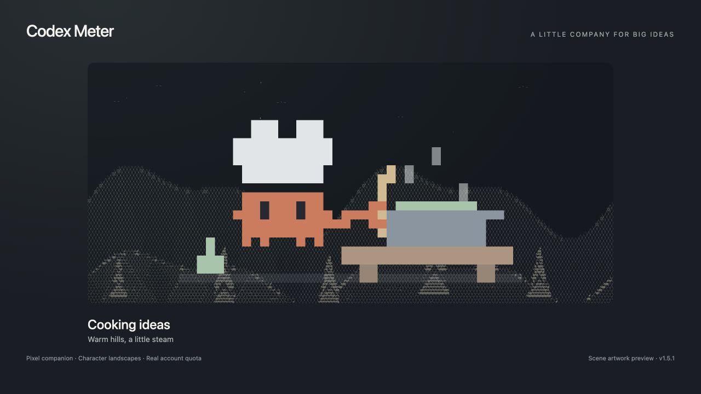
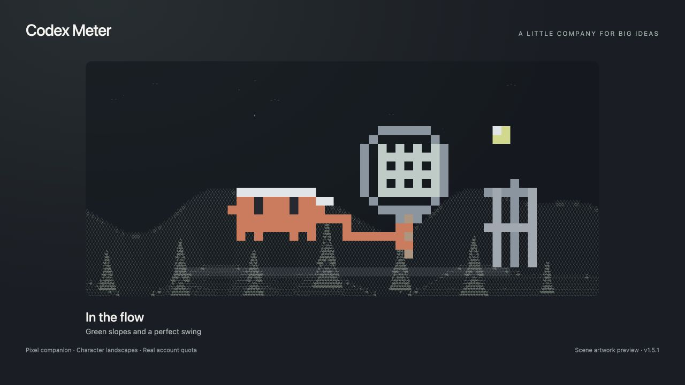
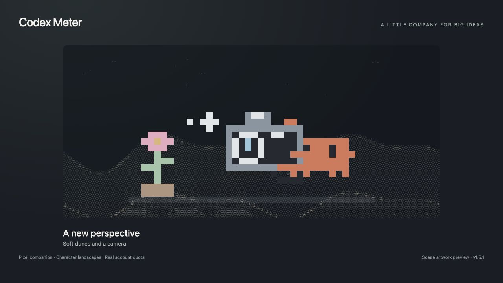
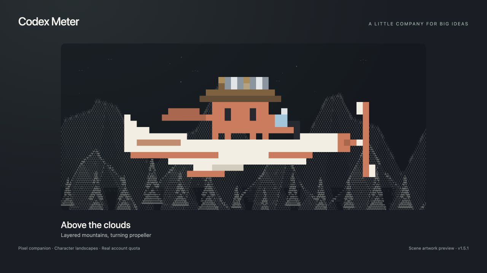
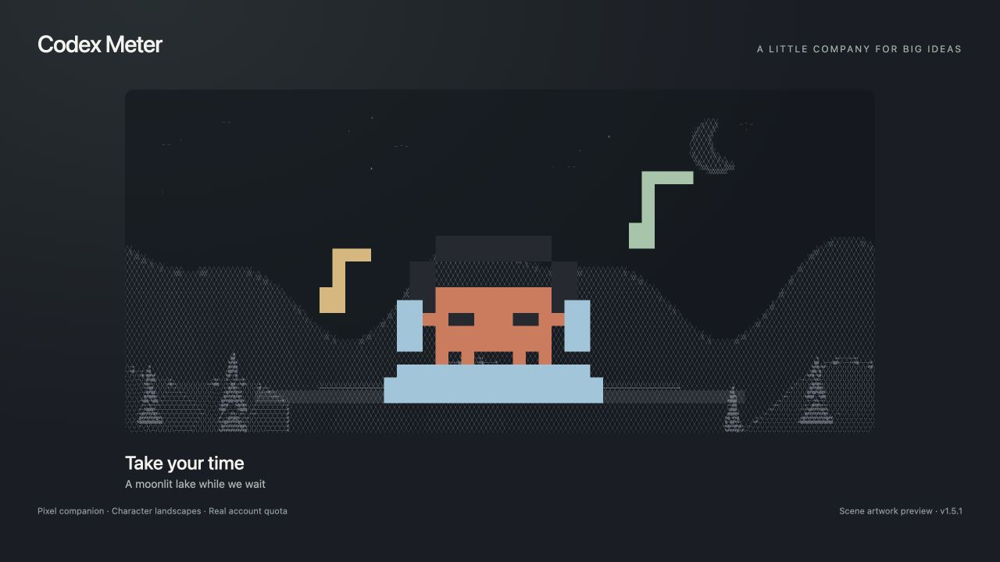
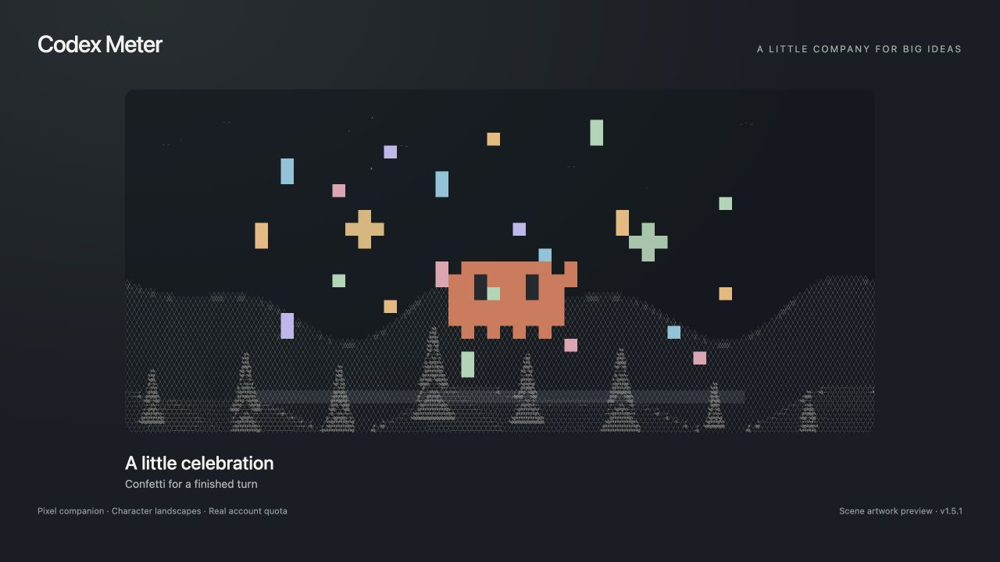

# Claude Meter / Codex Meter 🦀

A little desktop companion for your agents on macOS — now for **Claude** (v1.6.0), and **Codex** (v1.5.2).

Built by Tori with Codex and Claude. Remaining account quota, a compact task navigation bar, seven pixel scenes, and one consistent character-landscape style powered by [Tori Patterns](https://patterns.toritao.com/#/photo).



**Latest: Claude Meter v1.6.0 / build 12 · 2026-10-08 · macOS Apple Silicon.** Shows your remaining Claude quota live, follows your Claude Code sessions, and switches between 中文 and English.

## Claude Meter v1.6.0 — for Claude (2026-10-08)

| Full panel | Compact |
|---|---|
|  |  |

中文界面: [claude-meter-zh.png](claude-meter-zh.png)

**This version is for Claude, not Codex.** Same companion and scenes, but the meter shows your **remaining Claude quota** (the numbers on Claude's Usage page) and tracks **Claude Code sessions**.

- **Live Claude quota:** 5-hour and weekly limits (plus weekly Opus / Sonnet when your plan has them), remaining %, and reset countdowns, refreshed every 60 s from Anthropic's official read-only usage endpoint. Verified working on 2026-10-08.
- **Layout:** the big remaining % and its label share one left edge; in compact mode the left and right text columns share the same top and bottom lines.
- **中文 / English:** click the **EN / 中** button in the full panel header (or right-click → Switch to English). The choice is remembered and also applies to the menu, notifications and About box.
- **Task bar:** recent Claude Code sessions on this Mac (last 3 days) with working / done states, finish notifications and context fill.
- **Sign-in:** uses Claude Code's own login on this Mac, read locally from the macOS Keychain; it is sent only to `api.anthropic.com`. No model requests.

Downloads: [macOS Apple Silicon app](Claude-Meter-v1.6.0-macOS-arm64.zip) · [Complete source](Claude-Meter-v1.6.0-complete-source.zip) · [Manifest](claude-v1.6.0-manifest.json) · [SHA-256 checksums](SHA256SUMS-claude-v1.6.0.txt)

### Setup

1. Sign in Claude Code once: `claude auth login` (approve in the browser, paste the code back if asked).
2. Unzip the app to `~/Applications/Claude Meter.app` and open it. It is ad-hoc signed, not Apple-notarized: the first time, right-click the app → **Open** → **Open**, or run `xattr -dr com.apple.quarantine "$HOME/Applications/Claude Meter.app"`. If it still won't start, build from source (below). If macOS asks about the "Claude Code-credentials" keychain item, choose **Always Allow**.
3. **Region:** Anthropic rejects requests from unsupported regions such as Hong Kong (sign-in fails with 403, the meter shows a sync error). Use a proxy node in a supported region (e.g. Japan). The meter follows the macOS system proxy.

Build from source: unzip the source, `cd Claude-Meter-v1.6.0 && ./build.sh`, then copy `/private/tmp/claude-meter-build/Claude Meter.app` to `~/Applications/`.

The Codex version below is updated to v1.5.2 / build 12. This repository is currently private.

## Codex Meter v1.5.2 — download / restore

- [macOS Apple Silicon app](Codex-Meter-v1.5.2-macOS-arm64.zip) — the installed app snapshot.
- [Complete source, app and artwork backup](Codex-Meter-v1.5.2-complete-backup.zip) — original folder structure, build scripts, tests, source credits and all previews.
- [Git history bundle](Codex-Meter-v1.5.2-backup.bundle) — all local commits, branches and the `v1.5.2` tag; source commit `de97283f2f120a075fd085eeb87eb64ba035ebe1`.
- [Version manifest](v1.5.2-manifest.json) · [SHA-256 checksums](SHA256SUMS-v1.5.2.txt) · [Full usage notes](SOURCE-README-v1.5.2.md).

The GitHub archive commit and the source commit inside the bundle are separate histories. Use the source ZIP or bundle to build the app, rather than the root archive repository.

### Existing Mac installation

Quit Codex Meter, unzip the app archive, and place `Codex Meter.app` in `~/Applications/`. Open it after signing in to the official Codex app on that Mac. macOS 13+, Apple Silicon and Apple Command Line Tools / Python 3 are required. The app uses local ad-hoc signing and is not Apple-notarized; new machines may need to build it locally. Intel is not verified.

### Build from source

Unzip the complete backup and enter `Codex-Meter-v1.5.2`. Install Apple Command Line Tools if needed, then run:

```sh
xcode-select --install  # only if Command Line Tools are not already installed
python3 -m unittest -v test_bridge.py
./build.sh
mkdir -p "$HOME/Applications"
ditto --norsrc --noextattr "/private/tmp/codex-meter-build/Codex Meter.app" "$HOME/Applications/Codex Meter.app"
open "$HOME/Applications/Codex Meter.app"
```

JavaScript checks, if Node.js is installed: `node --test test_task_nav.cjs test_pet.cjs test_language.cjs`.

Restore the Git repository using:

```sh
git clone Codex-Meter-v1.5.2-backup.bundle codex-meter-source
cd codex-meter-source
git checkout v1.5.2
```

## New in v1.5.2

White `codex` identity in all sizes, aligned compact-panel labels, improved artwork spacing, and a persistent Chinese / English panel toggle beside Refresh in the full panel. Native menus and notifications remain Chinese. The scene artwork previews below were created for v1.5.1 and remain unchanged.

Previous v1.5.1 archives and checksums are retained.

## Seven matching scenes

| Deep work | Cooking ideas | In the flow |
|---|---|---|
|  |  |  |

| A new perspective | Above the clouds | Take your time |
|---|---|---|
|  |  |  |

[](scene-done.png)

All eight PNGs are 1280 × 720. They contain artwork only, with no personal task titles or account usage. [Video outline and Chinese / English X post drafts](LAUNCH-DRAFT.md) are ready for the next editing session.

## What the Codex version does today

- Reads real Codex account quota windows and reset times; quota percentage is not an API balance or a remaining-token count.
- Shows one selected task at a time, with arrows for navigation and reply-needed prompts.
- Five working activities, music while waiting, confetti when a turn finishes.
- Full, compact and pet-only modes; native macOS glass with light / dark appearance.
- Reads local state and the official read-only quota endpoint. Monitoring and cached scenery do not call a model.

Completion means the current response turn ended, not that the whole project is finished. Permission approval popups cannot all be detected reliably. Only recent, unarchived tasks with local logs on this Mac are covered. The Codex app monitors Codex; the separate Claude app is described above.

## Credits and earlier backup

Based on [Bon Yeung’s Claude-Meter](https://github.com/bonyuiux/Claude-Meter). Original UI and pixel character © 2026 Bon Yeung; original documentation and attribution remain in [UPSTREAM.md](UPSTREAM.md) and source comments. Character landscapes adapt [Tori Patterns Photo Lab](https://patterns.toritao.com/#/photo), with visual inspiration from [Claude FM](https://www.youtube.com/watch?v=tRsQsTMvPNg). Unofficial, not an OpenAI or Anthropic product.

The [v1.3.0 complete backup](Codex-Meter-v1.3.0-complete-backup.zip), [app](Codex-Meter-v1.3.0-macOS-arm64.zip) and [bundle](Codex-Meter-v1.3.0-backup.bundle) remain available. Backups exclude API keys, login credentials, task logs, usage caches and personal app preferences.
